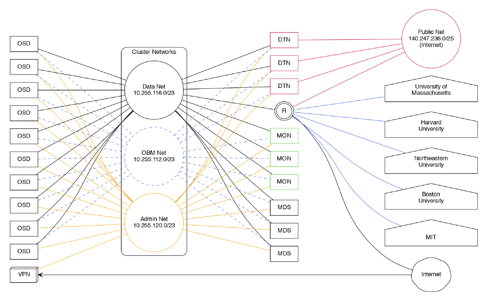

Technical Documentation
=======================

RADOS Block Device
------------------

RADOS Block Device (RBD) allows Ceph object storage mapping to local block devices using the RBD
kernel module or mapping to a Virtual Machine (VM) via hypervisor that is utilizing direct 
librbd access to the object storage. The mapped block devices could subsequently be accessed for
block storage or formatted with one of the many Linux file systems, therefore exposing the storage
via standard file access methods.

As Ceph architecture does not allow frequent creation and reconfiguration of pools, we will
create one CephX access key and one RBD pool pair per institution or per department and set a
fixed quota at the pool level. CephX access key will allow each institution to use standard rbd
client tools to create and manage RBD images within the given pool.

Please contact us at `help@nese.mghpcc.org <mailto:help@mese.mghpcc.org>`_ to establish and obtain
your institutional uid, access key, RBD data pool and RBD metadata pool.

General RBD Access Setup
^^^^^^^^^^^^^^^^^^^^^^^^

Fast direct network connection to the NESE OSD nodes located in the cluster data network
10.255.116.0/23 is required for RBD usage. For more info about establishing such a connection
see Direct Network Connection section.

To reduce incompatibility issues it's best to use the same version of Ceph client tools as the
NESE Ceph cluster runs on. NESE cluster is currently running Ceph version 14 (Nautilus). Ceph
RBD client tools are provided by the ceph-common package distributed by various linux
distributions and available directly from the upstream development repositories located at
http://download.ceph.com/.

After obtaining and installing the ceph-common package, make sure that the
/etc/ceph/ceph.conf general section contains cluster monitor hosts line and the client section
contains rbd default data and metadata pool names: ::

	mon host = [v2:10.255.116.11:3300,v1:10.255.116.11:6789],[v2:10.255.116.12:3300,
	v1:10.255.116.12:6789],[v2:10.255.116.13:3300,v1:10.255.116.13:6789],[v2:10.255.
	116.14:3300,v1:10.255.116.14:6789],[v2:10.255.116.15:3300,v1:10.255.116.15:6789]

	[client]
	rbd default data pool = <data-pool>
	rbd default pool = <metadata-pool>

Create /etc/ceph/ceph.keyring file and limit access to root only: ::

	$ touch /etc/ceph/ceph.keyring
	$ chown root:root /etc/ceph/ceph.keyring
	$ chmod 0600 /etc/ceph/ceph.keyring

Put your access key in the /etc/ceph/ceph.keyring file: ::

	[client.<uid>]
		key = <cephx-access-key>

Test direct access to the NESE ceph cluster: ::

	$ ceph --id <uid> status

Check quotas to set on your data and metadata pools: ::

	$ ceph --id <uid> osd pool get-quota <data-pool>
	$ ceph --id <uid> osd pool get-quota <metadata-pool>

RBD Images for Physical Machines
^^^^^^^^^^^^^^^^^^^^^^^^^^^^^^^^

Create a new RBD image: ::

	$ rbd --id <uid> create <image> --size 4T

Get info about an image: ::

	$ rbd --id <uid> info <image>

List all RBD images: ::

	$ rbd --id <uid> list

List current usage per image: ::

	$ rbd --id <uid> du

Manually map RBD devices
""""""""""""""""""""""""

::

	$ rbd --id <uid> device map <metadata-pool>/<image>

If your kernel does not support all the features enabled on the given image you might get an
error message explaining possible course of action. At this point you should upgrade your
kernel to a newer version. Disabling features is not recommended.

List all mapped devices: ::

	$ rbd device list

The mapped rbd device persistent naming follows this pattern:

/dev/rbd/<metadata-pool>/<image>

At this point you can create a file system on the block device: ::

	$ mkfs.xfs /dev/rbd/<metadata-pool>/<image>

Auto-map and auto mount RBD devices on boot
"""""""""""""""""""""""""""""""""""""""""""

Use noauto and noatime options in the /etc/fstab file: ::

	/dev/rbd/<metadata-pool>/<image> /mnt/dir xfs noauto,noatime 0 0

Enable rbdmap service: ::

	$ systemctl enable rbdmap.service

List each rbd device on a separate line in /etc/ceph/rbdmap file: ::

	<metadata-pool>/<image-name> id=<uid>,keyring=/etc/ceph/ceph.keyring

At this point you can test device mapping and mounting manually: ::

	$ rbdmap map /dev/rbd/<metadata-pool>/<image>

Or unmount and unmap a device manually: ::

	$ rbdmap unmap /dev/rbd/<metadata-pool>/<image>

At every system boot the rbdmap service will map all rbd devices listed in the
/etc/ceph/rbdmap file and then mount only those listed in the /etc/fstab file.

RBD Images for Virtual Machines
^^^^^^^^^^^^^^^^^^^^^^^^^^^^^^^

QEMU/KVM Hypervisor Commands
""""""""""""""""""""""""""""

Create a new QEMU RBD image: ::

	$ qemu-img create -f raw rbd:<metadata-pool>/<image>:id=<uid> 10G

Get the QEMU image info: ::

	$ qemu-img info rbd:<metadata-pool>/<image>:id=<uid>

Boot the VM up: ::

	$ qemu -m 2048 -drive format=raw,file=rbd:<metadata-pool>/<image>:id=<uid>

Resize the QEMU image: ::

	$ qemu-img resize rbd:<metadata-pool>/<image>:id=<uid> 15G

NESE Networks
-------------

While some administrative related resources are accessible through VPN connection, the
general NESE resources are accessible either via the Internet or through a direct network
connection to the NESE networks.

Direct Network Connection
^^^^^^^^^^^^^^^^^^^^^^^^^

Fast direct network connection to the NESE public network and/or cluster data network is
essential for optimal performance. To connect to the NESE Arista switch/router run a pair of
100Gbe or 40Gbe QFSP 28 cable to 7-B-12 in MGHPCC. Based on your need for direct access
to the cluster data network, decide if you want the 10.255.116.0/23 to be announced to you.
Provide point-to-point addressing for BGP peering and the prefix you will announce to our
network engineers. Contact Nick Amento or Christian Ranney with network connectivity related
questions.

Globus Configuration
--------------------

